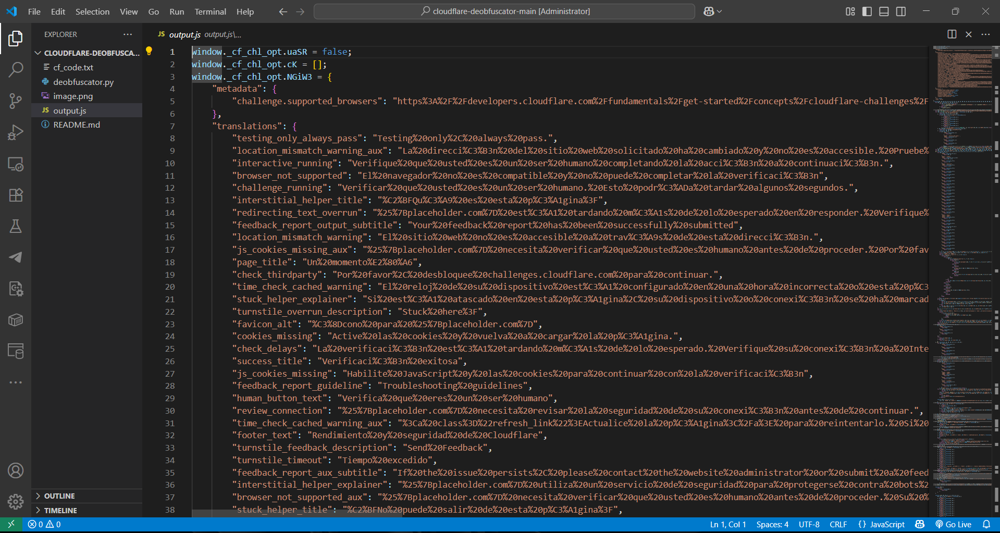

# Cloudflare JavaScript Deobfuscator

This project deobfuscates Cloudflare-protected JavaScript challenges.  
It extracts hidden strings, replaces obfuscated calls, and generates a readable version of the script.



---

## Features

- Parses heavily obfuscated Cloudflare challenge code.
- Automatically detects:
  - Obfuscated string arrays
  - Number transformation logic
  - Window/document variable replacements
- Reconstructs a readable JavaScript output.
- Saves the deobfuscated code to `output.js`.

---

## Project Structure

- **`cf_code.txt`**  
  The original Cloudflare-protected JavaScript challenge code.

- **`deobfuscator.py`**  
  Main Python script that:
  - Extracts and evaluates obfuscated data.
  - Maps numeric lookups back to real strings.
  - Produces cleaned JavaScript.

- **`output.js`**  
  The result after running `deobfuscator.py` on `cf_code.txt`.  
  Contains human-readable JavaScript logic.

- **`image.png`**  
  Project logo or diagram for documentation.

---

## Requirements

- Python 3.8+
- Dependencies:
  ```bash
  pip install jsbeautifier
